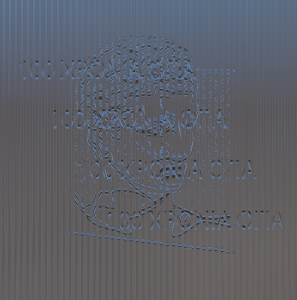
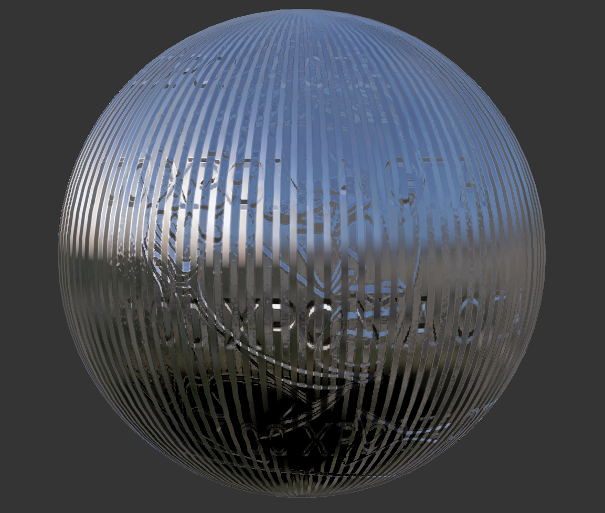
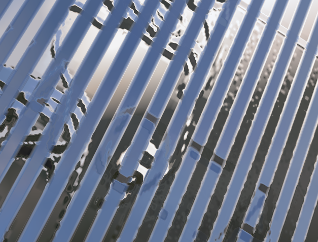
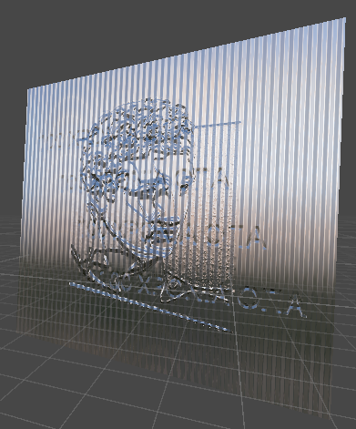
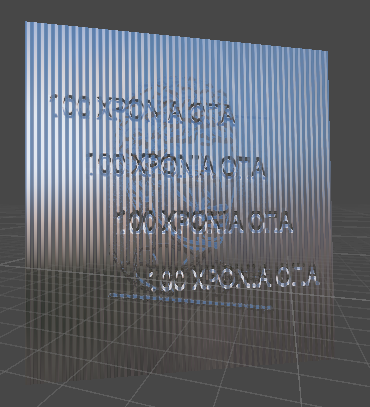
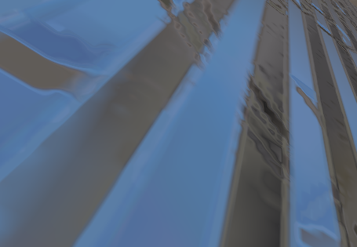
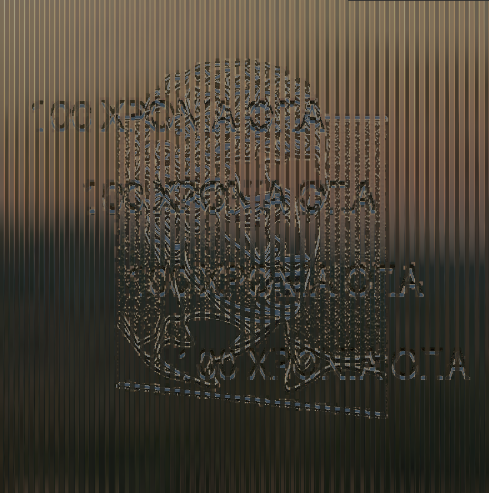

# BSc-Thesis by [Petros Chanas]()
## [Athens University of Economics and Business, Department of Informatics](https://www.dept.aueb.gr/en/infotech-overview-en)
## [Computer Graphics Group, AUEB](http://graphics.cs.aueb.gr/graphics/index.html)

### This repository contains the code for my BSc-Thesis in Computer Graphics regarding lenticular lenses and surfaces and ways to understand them using notions like texture mapping and blending, [BRDFs](https://en.wikipedia.org/wiki/Bidirectional_reflectance_distribution_function) and [BSDFs](https://en.wikipedia.org/wiki/Bidirectional_scattering_distribution_function), ambient occlusion and various others. This research aims to shed some light to the behavior of said surfaces by carefully breaking it down to modular parts that are directly connected to CG theory. To carry out the experiments I used Unity's [ShaderLab](https://docs.unity3d.com/Manual/SL-Reference.html). You can find the full paper in english [here](https://www.icloud.com/iclouddrive/0ffonv-sIB5OrABFOPdtu9fjw#Lenticular%5FLenses%5Fand%5FSurfaces) and the greek report [here](https://www.icloud.com/iclouddrive/022v7HvCDFMrQINvU9GD5s1Lw#%CE%A0%CF%84%CF%85%CF%87%CE%B9%CE%B1%CE%BA%CE%AE_%CE%95%CF%81%CE%B3%CE%B1%CF%83%CE%AF%CE%B1_%CE%A0%CE%AD%CF%84%CF%81%CE%BF%CF%85_%CE%A7%CE%AC%CE%BD%CE%B1)

## Explaining the Problem
A particular arrangement of convex and concave lenses
is used to create lenticular lenses, a form of optical lens.
These lenses are frequently employed to produce a variety
of visual effects, including holograms, motion graphics,
and 3D pictures. Lenticular lenses have a special shape
that enables them to refract light in a way that creates
the appearance of depth or movement. They use the prin-
ciples of optics related to refraction to create their visual
effects. Refraction is the bending of light as it passes
through a material with a different refractive index, such
as from air to plastic. This bending is determined by
the angle of incidence of the light ray and the refractive
index of the material. To calculate the direction of light
refraction as it goes through the lens, lenticular lenses use
Snell’s law. The law of refraction, often known as Snell’s
law, describes how light bends as it travels through var-
ious media. The rule asserts that the ratio of the refrac-
tive indices of the two media is equal to the sines of the
angles of incidence and refraction of a light ray.

")

### Methods used in the experiment
* **Normal Map Blending**: Blending of textures (normal maps) based solely on the PoV angle. If we consider that each texture has a corresponding weight $w_k$ which in our case takes only 2 values $w_1$ and $w_2$ then as the viewing angle $\hat{\theta}$ gradually changes so does the said weight. Obviously, $w_1 + w_2 = 1$ and $\sum\limits_{n \in \mathbb{N}} w_n = 1$
* **Planar Mapping**: Let's consider that the image we want to depict on the object is a flat projector, which "illuminates" the object with a parallel beam of rays. The result of this projection is the planar mapping. Essentially, planar mapping results from the use of a plane as an intermediate parametric surface in 3 dimensions and the parallel projection of every point of the object onto this plane. Suppose, for the sake of simplicity, that the plane is the $X$ and that the transition from the interval of $u$ and $v$ is corresponding to the real image takes place on the plane with the linear representation $u = ax$ and $v = by$. Then the mapping function will have the form: $(u,v) = \Phi_{planar}(x,y,z) =(\frac{x}{\alpha}, \frac{y}{\beta})$.Obviously, it is not mandatory to project the image onto the object considering it parallel to the plane $(X,Y)$. Planar mapping is used very often and gives the best results if applied to relatively flat surfaces. Also, due to its simplicity, it has also been implemented in hardware.
* **Grating Effect**: The core blending becomes much more apparant using the grating effect in our plane. That is obvious because as the angle changes so does the weight of each texture and that means that each grated corrugation is being illuminated more or less extensively. The basic form of the grating function is the following: $f_{grating} = \max \left (\left| \frac{\partial}{\partial y}(uv.x \times \ g_f) \right|, \left| \frac{\partial}{\partial x}(uv.x \times \ g_f) \right|\right )$ 
* **Environment Mapping**: Ambient rendering is a technique used to simulate the reflection and lighting effects of a 3D environment on a 3D object. It enhances the realism of computer-generated scenes by creating the illusion of reflective surfaces without the need for complex calculations. In environment rendering, a spherical or cube map texture is used to represent the environment of the 3D scene from a specific perspective, usually the camera position. This texture is then projected onto the surface of an object, effectively wrapping it in a reflective coating. When rendering the scene, the reflection and lighting information from this environment map is applied to the surface of the object, giving the appearance of reflections, highlights, and shading that match the environment.

### Zooming Properties
The behavior of the grating effect as we zoom in or out on the surface plane is affected by the frequency of the grid pattern and how it maps to the 3D object, in this case the plane we have our texture on. In general, when we apply a texture image to a surface, its texels are stretched and deformed so that they occupy the space assigned to them, always according to the local rate of change of the texture parameters and the dimensions of the polygons. 
Thus we conclude that texture scaling is the continuous highlighting of luminance discontinuities from texel to texel and the creation of a stepped image. where the isoparametric curves of the texture parameters are not parallel to the image sampling grid, thus creating pixelization of the image i.e. poor quality texture rendering. 



When we zoom in on a 3D surface, our perspective changes. As we get closer to the surface, the angles between the viewer, the surface, and the texture become less sharp. This means that the apparent distortion caused by the grooves or lenses in the lenticular pattern becomes less pronounced because you are looking at it from a more direct and less "oblique" angle. 
    The lenticular effect is often created by mapping a lenticular texture or pattern onto a 3D surface. When we zoom in, the texture coordinates \((u,v)\) on the surface are spread out more, that is, the distance between them widens. In other words, a smaller portion of the lenticular texture is mapped onto a larger area of the 3D object. This texture stretching effectively reduces the perceived distortion in the pattern because we see more of the individual texture elements. Practically this means that as I approach a limit constant of enlargement or reduction respectively I can express the individual distances of as the limit:
    $\lim\limits_{(u,v)\rightarrow z^\pm} d(u,v)$

By the term $z^{\pm}$ we express the zoom-in or zoom-out variable respectively, and the bounds are clearly used formally to denote the rate of change between the texture coordinates. We always assume that the variation between and is the same at each instance we consider.

As we zoom in, we may also see more detail in the texture due to the higher resolution of its mapping. This increased detail can make grooves or lenses appear less exaggerated and more subtle.

### Lenticular Effect in Zooming
As we can see at this level of magnification the effect of the lenticular switching between the textures thanks to the relief (grating) is evident. This is because at this level the relationship between frequency and scale is balanced, meaning that the weights of each normal texture are applied to a small rotation angle. In short, if I name the weight $w_1$ of one texture and the weight of the other $w_2$ then the switching $(w_1\leftrightarrow w_2)$ between the weights happens at a fairly small angle $\hat{\theta}$ and this has the consequence that the lenticular switching is presented as more direct to the eye.





#### Even further zooming
At this stage we have applied a higher zoom rate and we notice that for the same angle the switching between the weights is not as direct in percentage anyway we notice that the mixing between the textures is evident.



## Lighting via BRDFs
Apart from the usage of environment mapping to light our model and the inherent built-in *Unity* lighting which is achieved by declarations in the shader as well as in the console window we also use BRDFs to achieve the best photo-realistic outcome depending on the mathematical nature of each function.

### Cook-Torrance
The model is based on the physics of light reflection and considers various factors that contribute to the specular reflection of light. These factors include the microgeometry of the surface, the index of refraction of the material, and the properties of the incident light.

The Cook-Torrance model assumes that the surface of an object consists of many microfacets, each with its own orientation and roughness. It takes into account the distribution of these microfacets and how they interact with incoming light. The model calculates the amount of light reflected in a particular direction by considering the Fresnel term, which accounts for the change in reflectivity based on the angle of incidence.

The model also incorporates a term called the geometric attenuation factor, which accounts for the decrease in reflected light intensity due to the orientation of the microfacets relative to the viewer. Additionally, the Cook-Torrance model incorporates a term called the roughness term, which determines the size and shape of the microfacets and affects the overall appearance of the specular highlights.

The Cook-Torrance model is widely used in computer graphics for realistic rendering of materials such as metals, plastics, and glass. It provides a more accurate representation of specular reflections compared to simpler models like the Phong shading model. However, it can be computationally expensive to calculate, especially when dealing with complex scenes or large numbers of light sources.

In our experiment we use the following structure via helper functions:
#### Schlick's Approximation
 $F_{schlick}(specular_{color}, \cos \theta)$.In detail we can mathemtically represent this operation as $R(\theta) = R_0 + (1-R_0)(1 - \cos\theta)^5$. In our case R is the reflection coefficient and is equal to $(\frac{n_1 - n_2}{n_1 + n_2})^2$ where  $\theta$ is the angle between the direction from which the incident light is coming and the normal of the interface between the two media, hence $\cos \theta =(N\cdot V)$. And $n_{1},n_{2}$ are the indices of refraction of the two media at the interface and $R_{0}$ is the reflection coefficient for light incoming parallel to the normal (i.e., the value of the Fresnel term when $\theta =0$ or minimal reflection.

 ```GLSL
 float3 F_Schlick(float3 specularColor, float cosTheta)
        {
        return specularColor + (1.0 - specularColor) * pow(1.0 - cosTheta, 5.0);
        }
 ```

#### Smith's Geometric Term
In microfacet models such as the Cook-Torrance one the Smith geometric term is used to account for the masking and shadowing effects. It modifies the specular reflection term by considering the visibility of the microfacets from both the viewer's and the light's perspectives. It can properly be dissected as the product of 2 main visibilty functions: the viewer's perspective $(V)$ and the ligth's perspective $(L)$. As it accounts for the occlusion of microfacets by other microfacets in the surface seen by the viewers direction solely it can be mathematically be reprsented as:
$$V = \frac{G_v}{G_v + G_l - G_v * G_l + \epsilon}$$
where $G_v$ is the geometric attenuation factor for the viewer's perspective, $G_l$ is the geometric attenuation factor for the light's perspective and $\epsilon$  is a small value for safe division by zero. The Smith term for the light's perspective represents the visibility of the microfacets as seen from the light's direction. It accounts for the occlusion of microfacets by other microfacets in the surface. The equation for $L$ is similar to that of $V$

```GLSL
float G_Smith(float3 normal, float3 viewDir, float3 lightDir, float roughness)
        {
        float nDotV = max(dot(normal, viewDir), 0.0);
        float nDotL = max(dot(normal, lightDir), 0.0);
        float k = (roughness + 1.0) * (roughness + 1.0) / 8.0;
        float gl = nDotV / (nDotV * (1.0 - k) + k);
        float gv = nDotL / (nDotL * (1.0 - k) + k);
        return gl * gv;
        }
```

#### Trowbridge-Reitz Distribution Function $(D_{GGX})$
The Trowbridge-Reitz distribution function, also known as a variant of the \textbf{Beckmann-Spizzichino} distribution function, is a mathematical function used in the Cook-Torrance lighting model to describe the distribution of microfacets on a rough surface. It determines the probability density of the surface normals of these microfacets. The normalized form of the distribution is as follows:
$$D(\omega_h) = \frac{1}{\pi a_xa_y\cos^4\theta_h(1+\tan^2\theta_h(\frac{\cos^2\phi_x}{a^2_x}+\frac{\sin^2\phi_h}{a^2_y}))^2}$$
where $\omega_h$ is the differential area of microfacets with the surface normal. In comparison to the Beckmann–Spizzichino model, Trowbridge–Reitz has higher tails—it falls off to zero more slowly for directions far from the surface normal. This characteristic matches the properties of many real-world surfaces well.
```GLSL
 float D_GGX(float3 normal, float3 halfwayDir, float roughness)
         {
            float alpha = roughness * roughness;
            float alphaSqr = alpha * alpha;
            float nDotH = max(dot(normal, halfwayDir), 0.0);
            float nDotHSqr = nDotH * nDotH;
            float denom = nDotHSqr * (alphaSqr - 1.0) + 1.0;
            return alphaSqr / (3.14159 * denom * denom);
        }
```

### Oren-Nayar Ligting Model
We have \textbf{Lambertian BRDF} which is a theoretical model describing perfect diffuse reflection and **microfacet BRDF** which are based on geometrical optics theory, where a surface is covered with microfacets and described by means of statistical distributions. **Oren-Nayar BRDF** is an improvement over the theoretical Lambertian model, applying distribution of purely diffuse microfacets. It accounts for the roughness of a surface and how it scatters light. The model introduces a parameter called $\sigma$ which represents the standard deviation of the surface's microfacets. The model calculates the amount of reflected light by considering the angle between the incident light vector and the surface normal, as well as the angle between the view direction and the surface normal. It incorporates a cosine term to represent Lambertian diffuse reflection, and an additional term that depends on the roughness of the surface, introducing a roughness factor into the reflected light calculation.
**Essentially, we use the Oren-Nayar model to improve the Lambertian representation since our surface in not smooth**



### BRDF Properties
In order to preserve a material we have to capture and reproduce the way in which in interacts with incoming lighting under different illumination settings. Such property is relevant in digital preservation and physical based rendering as it correlates with material representations as functions instead of just constant colors. For example, we use the scattering equation to illustrate how such a function influences the calculation of the outgoing distribution of light at a point $p$ and a direction $\omega_o$
$$L_o(p, \omega) = \int_{S^{2}}f(p, \omega_o, \omega_i)L_i(p, \omega_i)|\cos\theta_i|d\omega_i$$
This equation describes $L_o(p, \omega_i)$ through the integration of the incident light at $p, L_i(p, \omega_i)$ coming from all directions $\omega_i$ in the unit sphere and taking the scattering properties of our material in consideration. The BRDF $f(p, \omega_o, \omega_i)$ is inherent to the scattering properties especially in our case where we are interested only in a specific grated material and we want to further understand the dissemination of light in that surface.

#### Ambient Occlusion
The ambient occlusion addition in the shader introduces a mathematical technique to simulate the darkening of crevices and corners due to ambient lighting. It leverages the principles of ray tracing and sampling theory to simulate the darkening of crevices and corners due to ambient lighting. We may improve the realism of the scene by multiplying the diffuse illumination by an ambient occlusion texture or doing it directly in the shader. Ray-tracing concepts and sample patterns are used to accomplish this. To calculate the occlusion factor at each pixel, the shader samples the immediate area. We approximate the quantity of ambient light obstructed by neighboring geometry by directing numerous beams in various directions and adding the findings. The diffuse lighting is then modulated using the obtained occlusion values, darkening sections that are more occluded and maintaining brightness in unoccluded places.

```GLSL
float3 calculateAmbientOcclusion(float2 uv)
            {
                return tex2D(_AmbientOcclusionTex, uv).rgb;
            }

```
